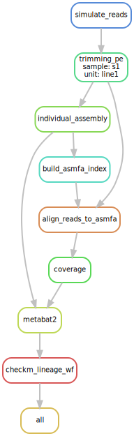
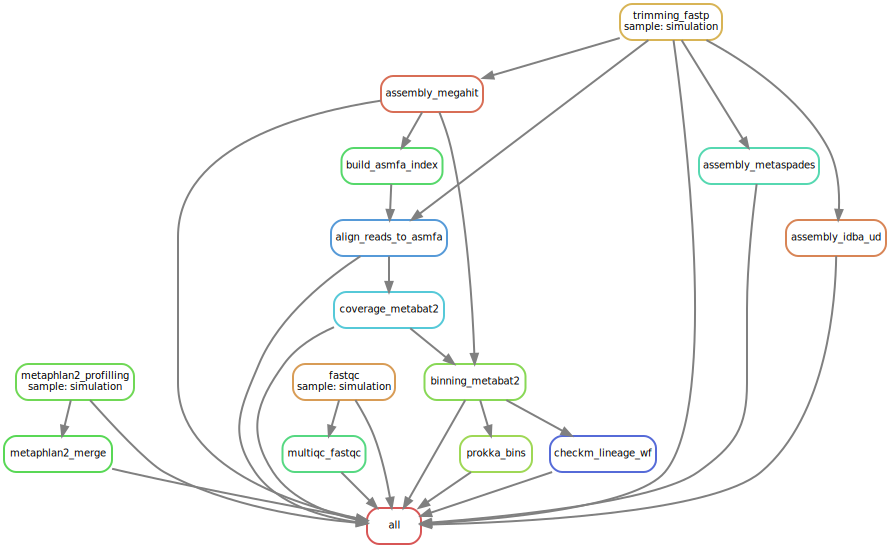

# **metapi**

hello, metagenomics!

## brother project

* [atlas](https://github.com/pnnl/atlas)
* [sunbeam](https://github.com/sunbeam-labs/sunbeam)

## motivation

  we all need a metagenomics pipeline for academic research.

## principle

* bind intelligense together
  * [github](https://github.com/search?q=metagenomics)
  * why we here?
* do not make wheels
  * [biopython](https://github.com/biopython/biopython)
  * [bioperl](http://bioperl.org)
  * [seqan](https://github.com/seqan/seqan)
* make full use of pipeline execution engine
  * [make](https://www.gnu.org/software/make/manual/make.html)
  * [snakemake](https://bitbucket.org/snakemake/snakemake)
  * [common workflow language](https://github.com/common-workflow-language/common-workflow-language)
  * [workflow definition language](https://software.broadinstitute.org/wdl/)
* make full use of awesome bioinformatics tools
  * [bwa](https://github.com/lh3/bwa)
  * [samtools](https://github.com/samtools/samtools)
  * [spades](https://github.com/ablab/spades)
  * [idba](https://github.com/loneknightpy/idba)
  * [megahit](https://github.com/voutcn/megahit)
  * [metabat](https://bitbucket.org/berkeleylab/metabat)
  * [checkm](https://github.com/Ecogenomics/CheckM)
* robust and module, extensible, update
  * one rule, one module
  * one module, one analysis
* welcome to PR

## design

* execution module
    ```python
    # Snakefile
        include: "rules/step.smk"
        include: "rules/simulation.smk"
        include: "rules/fastqc.smk"
        include: "rules/trimming.smk"
        include: "rules/rmhost.smk"
        include: "rules/assembly.smk"
        include: "rules/alignment.smk"
        include: "rules/binning.smk"
        include: "rules/checkm.smk"
        include: "rules/dereplication.smk"
        include: "rules/classification.smk"
        include: "rules/annotation.smk"
        include: "rules/profilling.smk"
    ```

* analysis module
  * raw data report
  * quality control
  * remove host sequences
  * assembly
  * assembly evaluation
  * binning
  * checkm
  * dereplication
  * bins profile
  * taxonomy classification
  * genome annotation
  * function annotation

* test module
  * execution test
  * analysis test

## install

* install dependencies*
  * [snakemake](https://snakemake.readthedocs.io)
  * [pigz](https://zlib.net/pigz/)
  * [ncbi-genome-download](https://github.com/kblin/ncbi-genome-download)
  * [InSilicoSeq](https://github.com/HadrienG/InSilicoSeq)
  * [OAFilter](https://github.com/Scelta/OAFilter)
  * [sickle](https://github.com/najoshi/sickle)
  * [fastp](https://github.com/OpenGene/fastp)
  * [MultiQC](https://github.com/ewels/MultiQC)
  * [bwa](https://github.com/lh3/bwa)
  * [samtools](https://github.com/samtools/samtools)
  * [bbmap](https://sourceforge.net/projects/bbmap)
  * [spades](https://github.com/ablab/spades)
  * [idba](https://github.com/loneknightpy/idba)
  * [megahit](https://github.com/voutcn/megahit)
  * [quast](https://sourceforge.net/projects/quast/)
  * [MetaBat](https://bitbucket.org/berkeleylab/metabat)
  * [MaxBin2](http://downloads.jbei.org/data/microbial_communities/MaxBin/MaxBin.html)
  * [CheckM](https://github.com/Ecogenomics/CheckM)
  * [drep](https://github.com/MrOlm/drep)
  * [prokka](https://github.com/tseemann/prokka)
  * [metaphlan2](https://bitbucket.org/biobakery/metaphlan2)

  ```bash
  # in python3 environment
  conda install snakemake pigz ncbi-genome-download sickle-trim fastp bwa samtools bbmap spades idba megahit maxbin2 prokka
  conda install -c ursky metabat2
  pip install drep insilicoseq

  # in python2 envrionment
  conda install quast checkm-genome metaphlan2

  # database configuration
  wget https://data.ace.uq.edu.au/public/CheckM_databases/checkm_data_2015_01_16.tar.gz
  mkdir checkm_data
  cd checkm_data
  tar -xzvf ../checkm_data_2015_01_16.tar.gz
  cd ..
  ln -s checkm_data checkm_data_latest

  # activate python2 environment where checkm in
  checkm data setRoot checkm_data_latest
  ```

* install metapipe

    ```bash
    git clone https://github.com/ohmeta/metapi
    ```

## example

* snakemake了解一下:)

    ```python
    rule bwa_mem:
    input:
        r1 = "fastq/sample_1.fq.gz",
        r2 = "fastq/sample_2.fq.gz",
        ref = "ref/ref.index
    output:
        bam = "sample.sort.bam",
        stat = "sample_flagstat.txt"
    params:
        bwa_t = 8,
        samtools_t = 8
    shell:
        "bwa mem -t {params.bwa_t} {input.ref} {input.r1} {input.r2} | "
        "samtools view -@{params.samtools_t} -hbS - | "
        "tee >(samtools flagstat -@{params.samtools_t} - > {output.stat}) | "
        "samtools sort -@{params.samtools_t} -o {output.bam} -"
    ```

* a simulated metagenomics data test(uncomplete)

    ```bash
    # in metapi/example/basic_test directory
    cd example/basic_test

    # look
    snakemake --dag | dot -Tsvg > dat.svg
    ```
    

    ```bash
    # run on local
    snakemake

    # run on SGE cluster
    snakemake --jobs 80 --cluster "qsub -S /bin/bash -cwd -q {queue} -P {project_id} -l vf=8G,p=8"
    ```

* a real world metagenomics data process(uncomplete)

    ```bash
    # in metapipe directory
    # look
    cd metapi
    snakemake --dag | dot -Tsvg > ../docs/dat.svg
    ```
    

    ```bash
    # run on local
    snakemake --snakefile metapi/Snakefile --configfile metapi/metaconfig.yaml

    # run on SGE cluster
    snakemake --snakefile metapi/Snakefile --configfile metapi/metaconfig.yaml --cores 32 --jobs 80 --cluster "qsub -S /bin/bash -cwd -q {queue} -P {project_id} -l vf=8G,p=8"
    ```
